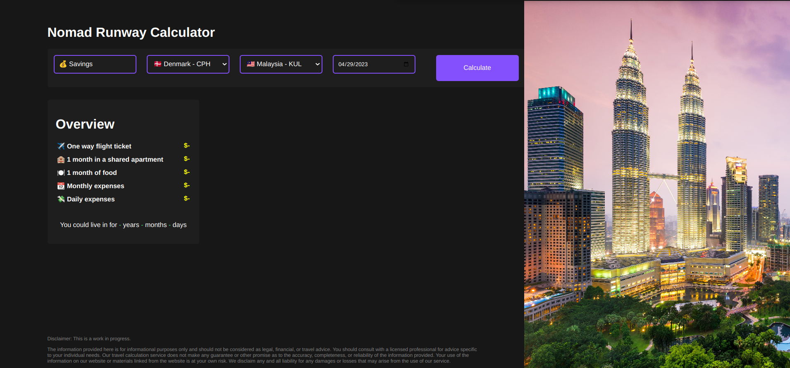
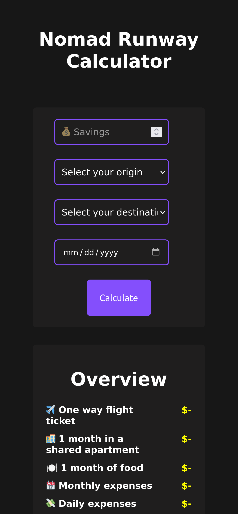

# Nomadrunway ✈️

## Description

Calculate your runway for your next adventure 🌍

## Picture of the app
### Web

### Mobile

## How i built it
1. Designed the UI in Figma
2. Built the UI in React
3. Built backend in Node.js
5. Connected the frontend and backend
6. Deployed the app

# ToDo 
- [ ] Support for more currencies
- [ ] Input validation
- [ ] Better styling for 'Savings' field
- [ ] Fix footer
- [ ] Fix picture on Chrome
- [ ] Actually use typescript correct way hehe

## Feedback

If you have any feedback, please reach out to me or create a PR!

